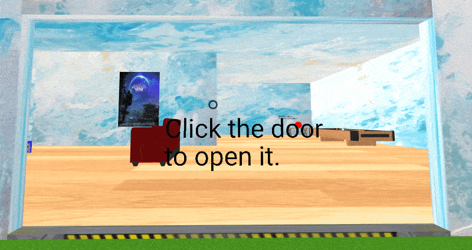
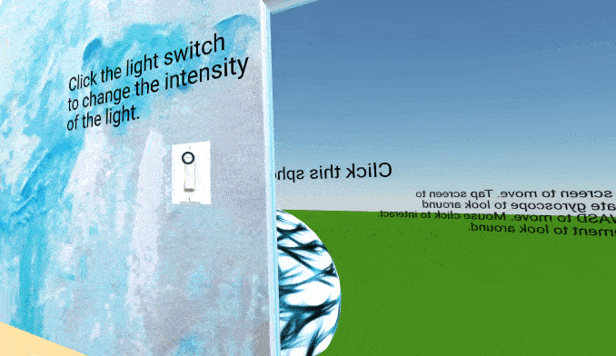

# CS 4331-001 - Virtual Reality Project 1
## Due: February 20, 2018

## Video demonstration
   - (Video embed here :soon:)

## The web application can be found at http://swoldemi.me/VR-Project-1
   
## Project Report

### I learned...
  - The basics of Three.js and A-Frame
  - How to bind objects to JavaScript functions (using onlick="functionName()")
  - How the Document Object Model works (DOM)
  - Front-end design techniques that greatly take into consideration UX results
  - How to manipulate 3-D `.gltf` models
  - General JavaScript library usage
  - How to use Chrome's web development tools
  - The meta of WebVR and the existence of cool online virtual reality applications
  - The I do not enjoy front-end development

### Contributors
 - Individual project; All work was completed by Simon Woldemichael.

### Work Distribution
 - Individual project

In the JavaScript functions explained below, the following global variables (declared in the HTML head) are used for simplicity
```javascript
var paused = false; // For sound toggle
var new_position = new Object({x: .052, y: .032, z: -1.49}); // For spawning more cubes
var color_count = 0; // For applying new colors to new cubes

// Variables for positioning the door
var door_opened_position = new Object({x: 24.78, y: -3.14, z: .005});
var door_closed_position = new Object({x: 24.78, y: 3.128, z: .005});
var isOpened = false;
var isClosed = true;
```

### Key features
Physics: You are unable to walk through the walls of the home or any other objects that have the `static-body` attribute. Objects that are labled as `dynamic-body` are affected by physics (bounce, roll, move) and can be moved by the camera as well. These features are achieved by applying a `kinematic-body` to the camera.

### Dynamic features/interactables


Clicking on the door at the front of the house allows you to walk through the door

This is achieved with the `setLightIntensity()` Javscript function (below). Using the `querySelector` we select the id of the textured box that acts as a door (or gate) and when that box is clicked we set the position of the boxed. These are stored in `door_opened_position` and `door_closed_position`.

```javascript
function setLightIntensity(){
	var light = document.querySelector('#house-light');
	var current_intensity = light.getAttribute('intensity');
	console.log(current_intensity);
	if(current_intensity == 1)
		light.setAttribute('intensity', .5);
	else if(current_intensity == .5)
		light.setAttribute('intensity', .25);
	else if(current_intensity == .25)
		light.setAttribute('intensity', .145);
	else if (current_intensity == .145)
		light.setAttribute('intensity', .0725);
	else if(current_intensity == .0725)
		light.setAttribute('intensity', 0);
	else
		light.setAttribute('intensity', 1);
}
```


Clicking on the sphere located in front of the door will spawn a sphere (1 per click) and these spheres can be rolled around by walking forward into them.

This is achieved with the `makeSphere()` Javscript function (below). Using the `querySelector` we select the id of the initial sphere that is clicked and append children to this sphere *each time* _any_ of the children or the parent are clicked. Using `make_box.setAttribute('dynamic-body', true)` the spheres become physical objects.

```javascript
function makeSphere(){
	var colors = ['red', 'yellow', 'green', 'purple', 'pink', 'white', 'black', 'blue'];
	var initial_radius = 1;
	var box = document.querySelector('#cool-sphere');
	let make_box = document.createElement('a-sphere'); //let statement declares a block scope local variable
	new_position.z = new_position.z + 3; // Move the new box back 3 meters
	make_box.setAttribute('position', new_position);
	make_box.setAttribute('color', colors[color_count]);
	make_box.setAttribute('dynamic-body', true); // Gravity affects these spheres, can be moved by the camera too
	color_count++; // Get the next color
	if(color_count >= colors.length)
		color_count = 0; // Reset if we've reached the last color
	box.appendChild(make_box);
}
```


Because the spheres that are spawned have the `dynamic-body` attribute, they, like the camera, do not clip through the camera.



Clicking on a lightswitch located within the house will control the lighting in the scene.

This is achieved with the `setLightIntensity()` Javscript function (below). Using the `querySelector` we select the id of the main light in the scene, get the current intensity each time the light switch is clicked and depending on the current intensity, set a new intensity.

```javascript
function setLightIntensity(){
	var light = document.querySelector('#house-light');
	var current_intensity = light.getAttribute('intensity');
	console.log(current_intensity);
	if(current_intensity == 1)
		light.setAttribute('intensity', .5);
	else if(current_intensity == .5)
		light.setAttribute('intensity', .25);
	else if(current_intensity == .25)
		light.setAttribute('intensity', .145);
	else if (current_intensity == .145)
		light.setAttribute('intensity', .0725);
	else if(current_intensity == .0725)
		light.setAttribute('intensity', 0);
	else
		light.setAttribute('intensity', 1);
}
```

### Grade Requirements
 - For a C
   - [x] Customize your dream house with your own style of floor and ceiling
   - [x] Have at least 10 models at appropriate locations
   - [x] Have appropriate lighting
 - For a B
   - [x] Add an additional 5 unique models
   - [x] Give the use control over the lighting (light switch within the scene)
   - [x] Be able to navigate around the space
 - For an A
   - [x] Interact with certain objects (Clickable sound player, front door, and sphere that spawns dynamic-body spheres that are affected by gravity/physics)

### Planned timeline and sources as to how everything was achieved
1) Add a skybox.
   - [Example 1](https://aframe.io/aframe/examples/test/shaders/)
   
2) Add home frame with outer walls that cannot be walked through (maybe a cool shader too)
   - [Preventing walking through walls example](https://webvr.donmccurdy.com/walls/)

3) Add a ground plane with a realistic texture
   - [Example 1](https://aframe.io/examples/showcase/hello-metaverse/)
   - The ground plane also holds up the entire scene given there is -10 m/s gravity in the scene
   
4) Add 1 main room and a surrounding area outside of the main room

5) Add 15 models to the scene
   - For simplicity, use .gltf format models (sources below)
   - [If needed, compress the number of faces on all of them in MeshLab](https://www.shapeways.com/tutorials/polygon_reduction_with_meshlab)
   - *All* models should be below 800-900KB for mobile space optimization/efficiency
  
6) Add an animation to a model to make it a dynamic object
   - [Example 1](https://blog.prototypr.io/learning-a-frame-how-to-do-animations-2aac1ae461da)
   - [Example 2](https://aframe.io/docs/0.7.0/introduction/models.html)

7) Add a water 'shader' to make up a swimming pool
   - [Example 1](https://webvr.donmccurdy.com/water/)

8) Remove default lighting to give the user control over lighting
   - [Example 1](https://aframe.io/docs/0.7.0/introduction/javascript-events-dom-apis.html)
   - This is achieved by following [very basic DOM concepts](https://aframe.io/docs/0.7.0/introduction/javascript-events-dom-apis.html)
   - When the user clicks on a 'light switch', the lighting within the room will to and from grey and white

9) Add a music player or radio of some sort and allow the user to stop and play the song
   - [Resonant bodies play positional sound (really cool)](https://github.com/etiennepinchon/aframe-resonance)
   - Stopping and playing the radio is achieved using the same concepts applied to control lighting

10) Helpful sources:
    - https://github.com/donmccurdy/aframe-extras/issues/149
    - https://stackoverflow.com/questions/42087566/add-speed-to-wasd-controls-for-a-frame
    - https://stackoverflow.com/questions/41669122/how-do-i-copy-the-position-and-rotation-of-a-camera-child-a-frame-entity-to-use

### External model sources
  - Radio: https://sketchfab.com/models/e7172544d7984d3b8b7ac0cc6c9ae693
  - Table: https://sketchfab.com/models/28e73c5dd9674b349a0c7ba06fb34e1c
  - Phone: https://sketchfab.com/models/d77a5f2004004822b527edb8090fcbcf
  - Dog:  https://sketchfab.com/models/335f2250195c407bac91695fbdd193e1
  - Robot: https://sketchfab.com/models/331bc62673a9416591c0bf6b186caa8c
  - Car: https://sketchfab.com/models/e6af23e051644eaabba1299709aa6f2b
  - Couch: https://sketchfab.com/models/0bbeae4fe59b4e44bed8d06f5cb415bf
  - CRT TV: https://sketchfab.com/models/5ab87913300f474a96b218b10c9ab3d4
  - GameCube: https://sketchfab.com/models/ff244730d22e4581a3f505201e63925e
  - Lamp: https://sketchfab.com/models/1a50b7ee150a45e583674cd319bb82eb
  - Chair: https://sketchfab.com/models/ff8cb5a736494a84929199e111bfefd3
  - Pool table: https://sketchfab.com/models/625c012402074e91a1a534b771920a17
  - Laptop: https://sketchfab.com/models/9a960986f0cc49f99a0afdfb486ec859
  - Bed: https://sketchfab.com/models/86d5c8b1addf4f138d8f0c2cf06e9ba0
